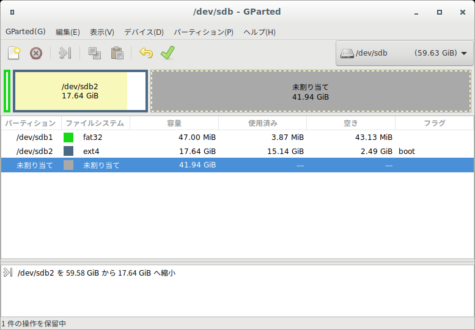

# インストール済みのイメージのバックアップ

いざというときのために、設定済みの環境をとっておく。

バックアップをリストアすれば完全に同じ環境が再現できるので、開発者間で環境をあわせるのにも便利

## 準備

1. バックアップする環境よりも容量の大きいディスクスペース
2. GPartedが起動できるブート可能Linuxメディア

## 手順

1. 準備の2で用意したメディアからブートする
2. バックアップするディスクの容量を縮める。（使用領域＋2,3Gバイト程度に縮める)
    - GPartedを起動して、バックアップするドライブ(ここではsdb)を開く
    - 
    - 使用済みの領域15G程度なので、17Gちょっとまで縮める
    - 
3. 使用しているブロックサイズを確認する
    - ターミナルを開いて、コマンドを叩くsudo fdisk -l /dev/sdb

```shell
hyt@usbuntu:~$ sudo fdisk -l /dev/sdb
[sudo] hyt のパスワード:
ディスク /dev/sdb: 59.6 GiB, 64023257088 バイト, 125045424 セクタ
単位: セクタ (1 * 512 = 512 バイト)
セクタサイズ (論理 / 物理): 512 バイト / 512 バイト
I/O サイズ (最小 / 推奨): 512 バイト / 512 バイト
ディスクラベルのタイプ: dos
ディスク識別子: 0x0002f2a2

デバイス   起動 開始位置 最後から   セクタ サイズ Id タイプ
/dev/sdb1           2048    98303    96256    47M  b W95 FAT32
/dev/sdb2  *       98304 37083135 36984832  17.7G 83 Linux
```

4. 縮めたパーティションのブロック+1までバックアップする

- この例では、コマンドを叩いてsdb2のブロックの終わりが37083135なので37083136までバックアップする
- sudo dd if=/dev/sdb of=usbubuntu.img bs=512 count=37083136
